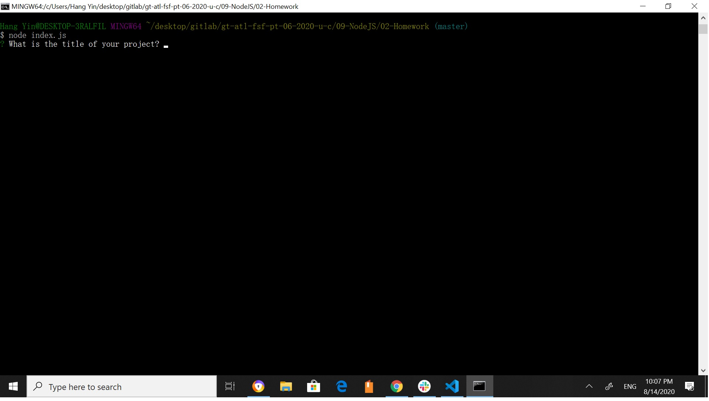
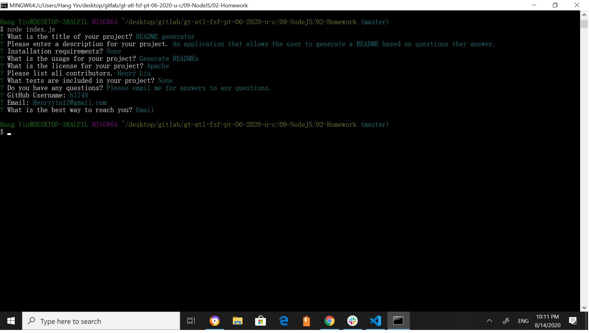
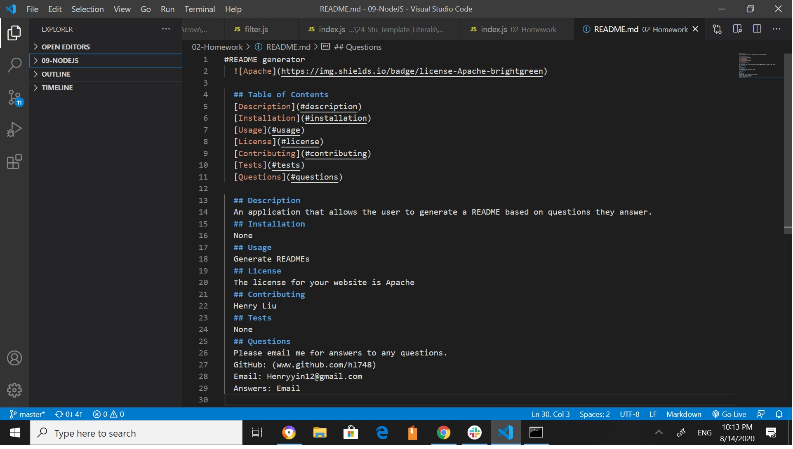

# README Generator

## Description
This application is for developers that want to quickly create a good README file. When the user is in the folder of this application and runs "node index.js", the application prompts the user with a series of questions related to their project in the command line. Then, the application generates a README file in markdown using the answers that were provided by the user.

1. Run "node index.js" while in the folder of the application in command line.

2. Answer the questions prompted by the application.

3. The README file is generated based on the user's answers to the application's questions.

<figure class="video_container">
  <iframe src="https://drive.google.com/file/d/1qAjH8qm1E-N1ROe590aKjqyuL3FEv1SB/preview" width="640" height="480"></iframe>
</figure>