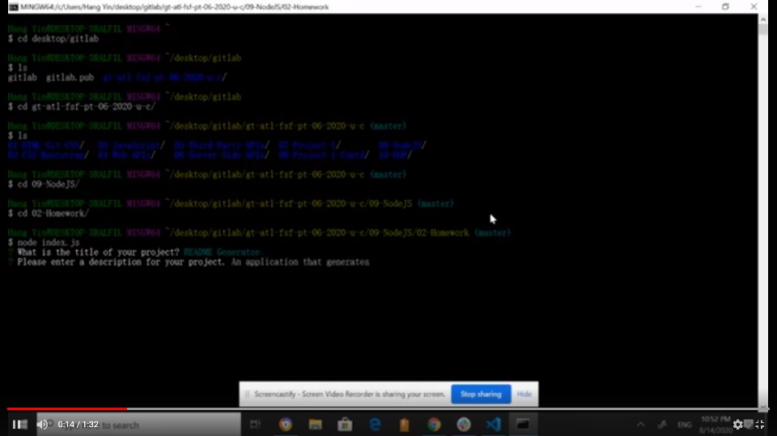

# README Generator

## Description
This application is for developers that want to quickly create an excellent README file. When the user is in the folder of this application and runs using "node index.js", the application prompts the user with a series of questions related to their project in the command line. The application generates a README file in markdown using the provided answers.

1. Run with "node index.js" in the application in command line.

2. Enter the questions prompted by the application.

3. The README file is generated based on responses.

Link to Demo:

